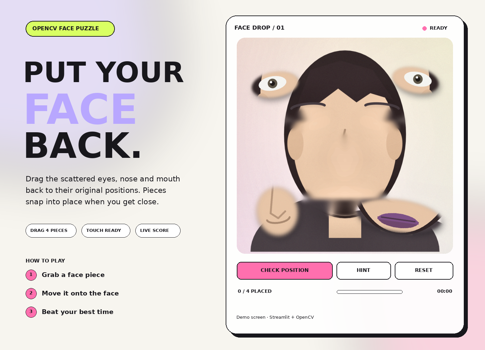

# FACE DROP

사진에서 눈·코·입을 분리해 원래 위치에 맞추는 Streamlit + OpenCV 드래그 퍼즐입니다.

## 기능

- 기본 데모 얼굴로 즉시 플레이
- JPG, PNG, WEBP 업로드 및 카메라 촬영
- OpenCV Haar Cascade 얼굴 감지
- OpenCV 마스킹·인페인팅으로 얼굴판과 투명 PNG 조각 자동 생성
- 마우스·모바일 터치 드래그
- 쉬움/보통/어려움 난이도, 힌트, 위치 검사, 타이머, 점수
- 얼굴 감지 실패 시 중앙 크롭으로 안전하게 대체

## 권장 사진

정면을 보고 있고, 얼굴이 사진의 절반 이상이며, 조명이 밝은 사진에서 가장 자연스럽게 작동합니다.
